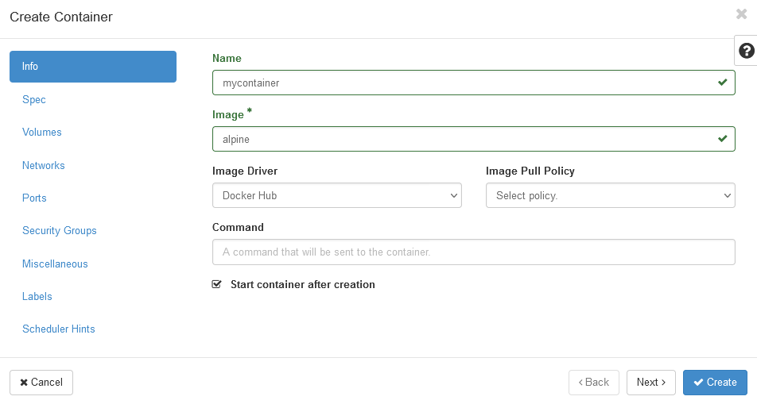
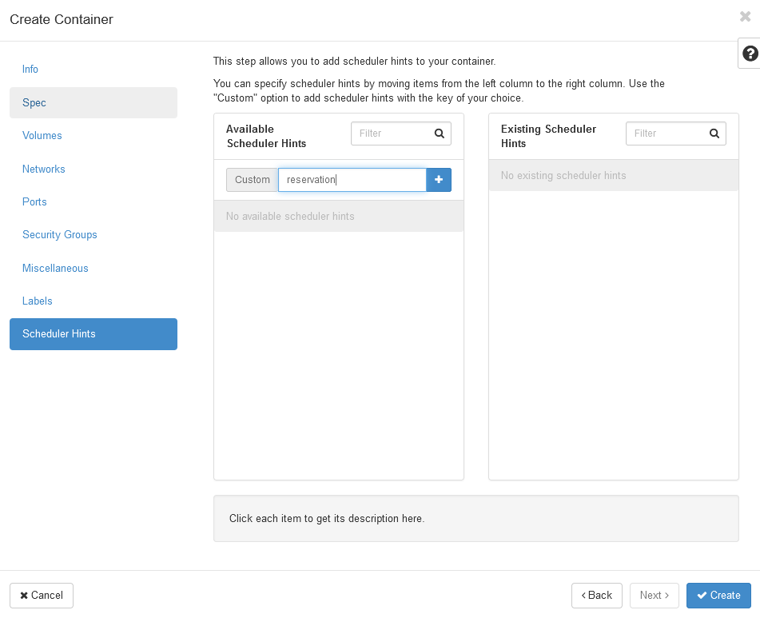
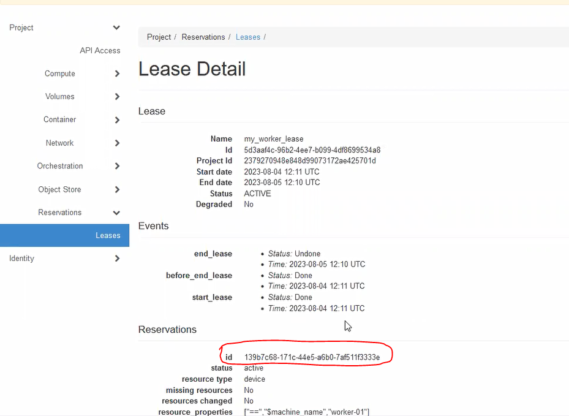
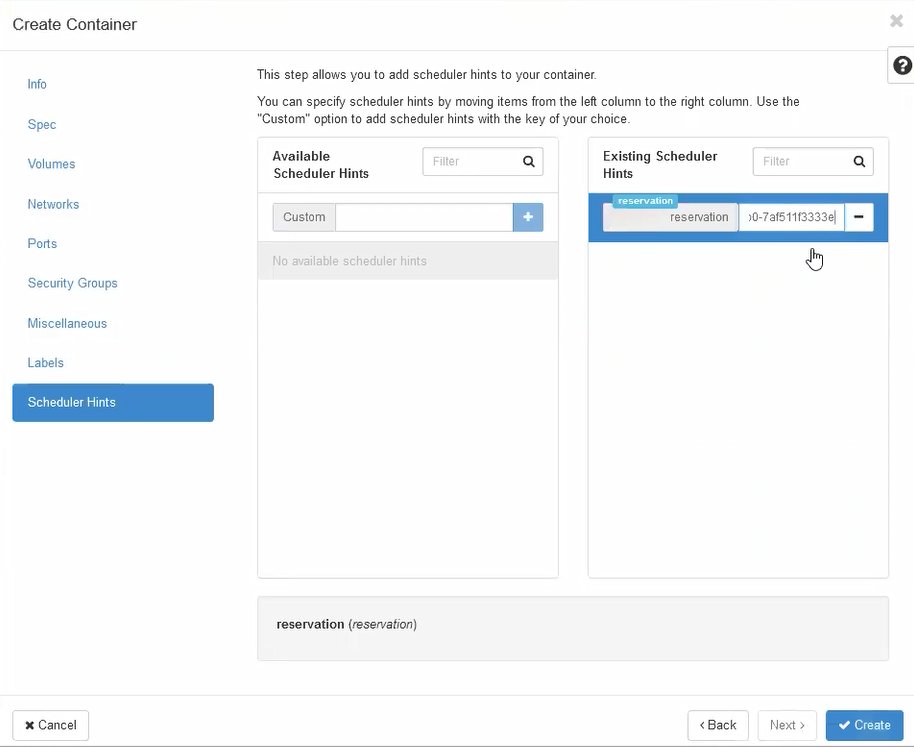
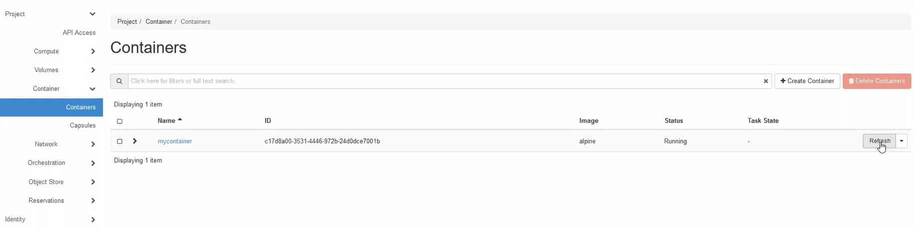
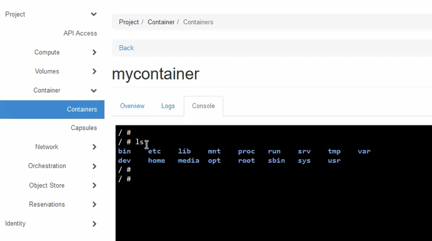

.. _container-basic:

==========================================
Running a basic container on a worker node
==========================================

This guide will walk you through the steps of running a very basic container on a worker node.

Step 1: Reserve a worker node
=============================

See the "reservation of a worker node" section.

Step 2: Create a container
==========================

* From the ExPECA home page, click *Container* -> *Containers*

.. figure:: containers.png
  :alt: Containers main page
  :figclass: screenshot

* Click *+ Create Container*
* Under *Info* tab, give the container a name of your choosing, which can NOT contain the "underscore" (_) character
* Type "alpine" as image name (or a Docker hub image of your choosing)

* Under *Scheduler Hints* tab, add "reservation" as .. hint

* Paste the "reservation ID" for the worker node lease you have created. Note that the
  "reservation ID" can be obtained from *Reservations* -> *Leases* -> click on your lease.

* Now click on *Create* to create your container. After a short time, the container is created, and by default should be running.

* Click on your container and then on the *Console* tab. You then have an interactive console where you can give commands in your 
  container. It is created from a Linux image, so basic Linux commands are available.

