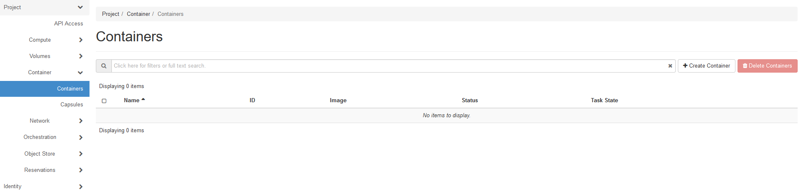
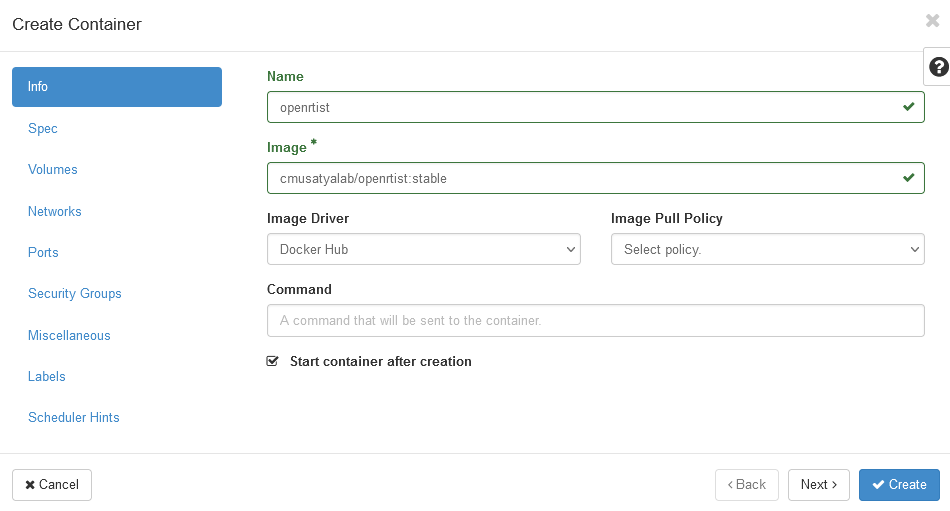
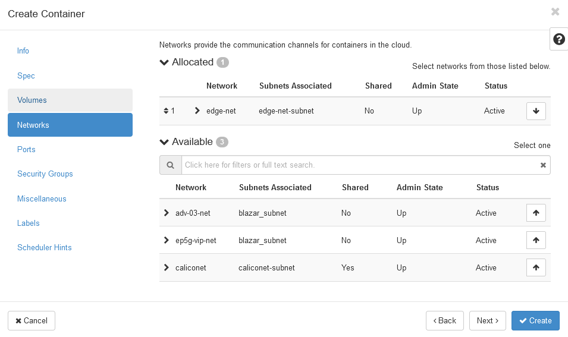
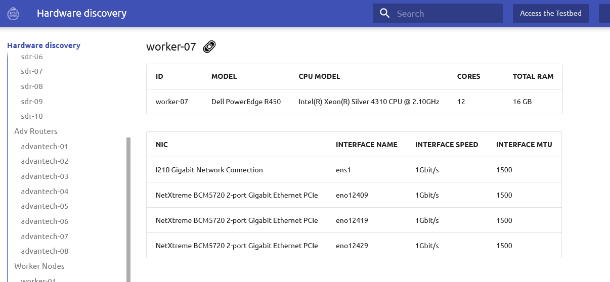
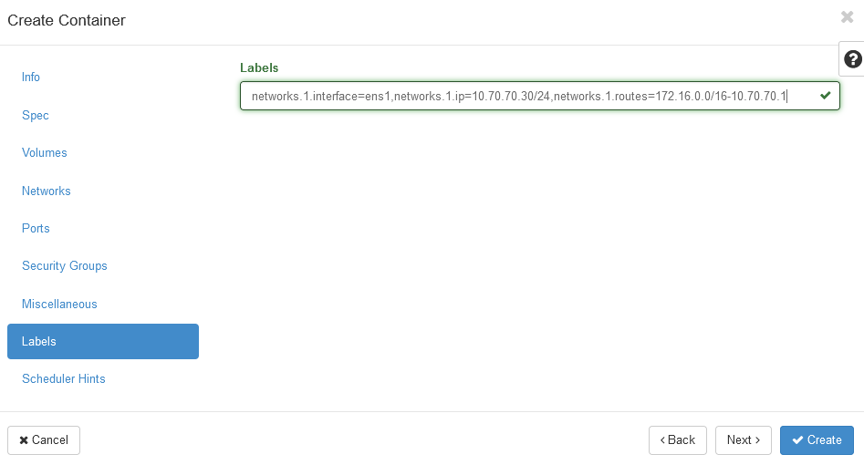
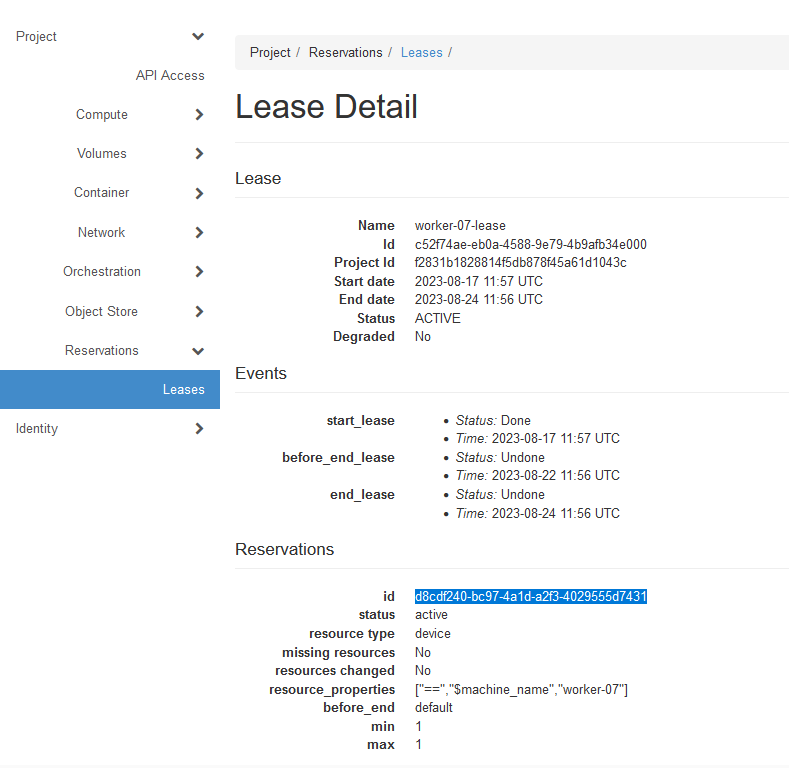
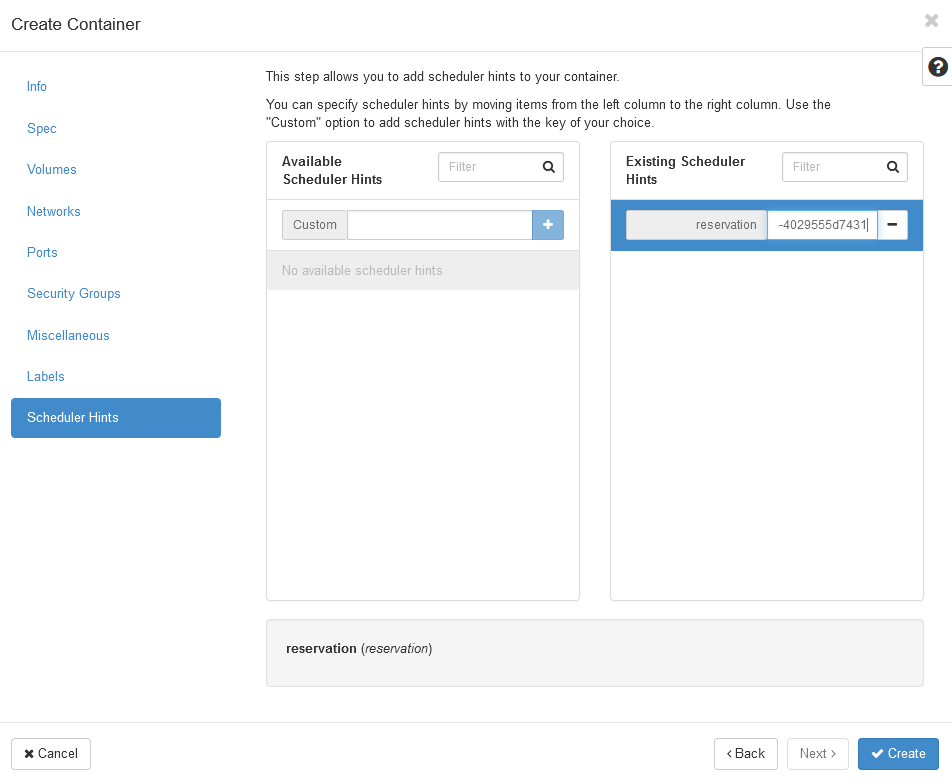

.. _container-vs-ep5g:

==========================================
Running a container networked towards EP5G
==========================================

This guide will walk you through the steps of running a server container on a worker node, complete with networking definitions that allow
clients using EP5G to communicate with the server container application.

Step 1: Reserve a worker node
=============================

See the "reservation of a worker node" section.

Step 2: Reserve EP5G and define edge networking
===============================================

See the "Network definittion for EP5G" section. The subnet "10.70.70.0/24" subnet defined at the end there, for
communication with a container in a worker node, will be used here towards the container application.

Step 3: Create a container
==========================

We will here create a container with the "Openrtist" backend application. "Openrtist" has two parts, a client and a backend application.
The client sends a video feed to the backend, which processes it and sends it back to the client with the appearance
inspired by famous paintings. The client, in this case, will run on a user of the EP5G system.

* From the ExPECA home page, click *Container* -> *Containers*

* Click *+ Create Container*
* Under *Info* tab, give the container the name "openrtist"
* Type "cmusatyalab/openrtist:stable" as image name

* Under *Networks* tab, click the arrow to the right of the network you have defined for local communication with containers.
  It will then move up to the "allocated" section. In this case, that network name is "edge-net"

* Under *Labels* tab, define the network interface we will use in the worker node, the IP address to use for the container, and the running_container
  we will use to route traffic back towards the EP5G network. In this case, it is
  "networks.1.interface=ens1,networks.1.ip=10.70.70.30/24,networks.1.routes=172.16.0.0/16-10.70.70.1"
* Note that the interface is picked from the Hardware Discovery section for your chosen worker node, the IP is picked from the subnet of your "local network",
  and the route back to EP5G uses the subnet of EP5G (172.16.0.0/16) and the default gateway of your "local network". "Local network", in this case, is
  "edge-net".

* Under *Scheduler Hints* tab, add "reservation" as hint
* Paste the "reservation ID" for the worker node lease you have created. Note that the
  "reservation ID" can be obtained from *Reservations* -> *Leases* -> click on your lease.

* Now click on *Create* to create your container. After a short time, the container is created, and by default should be running.

