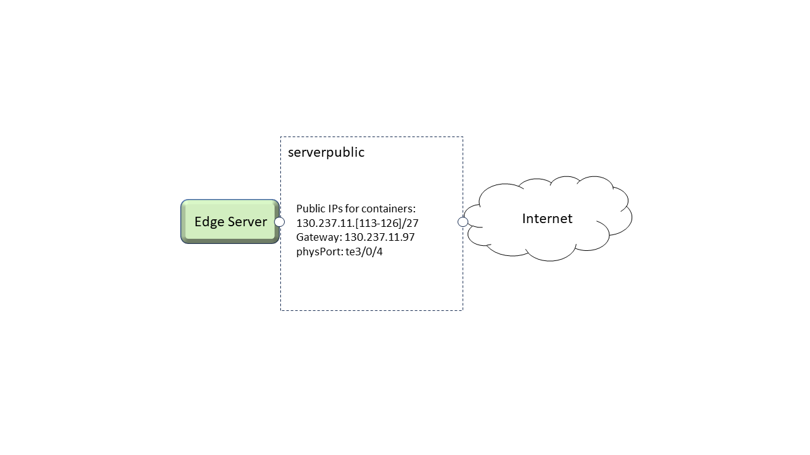
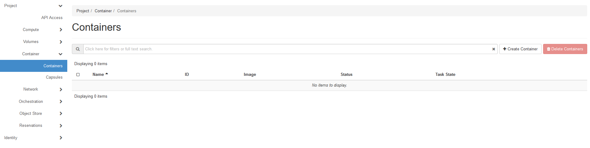
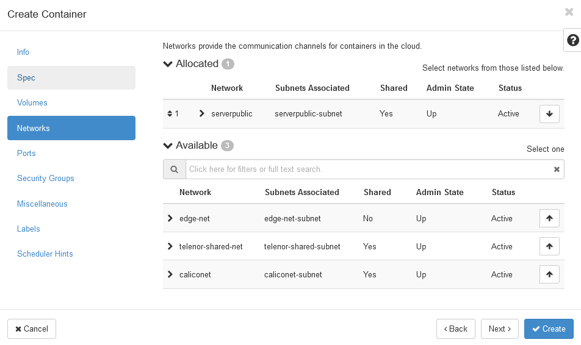
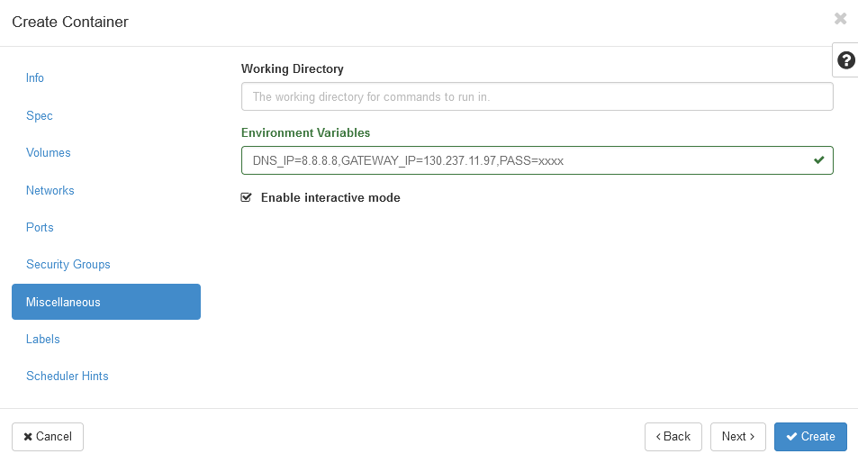
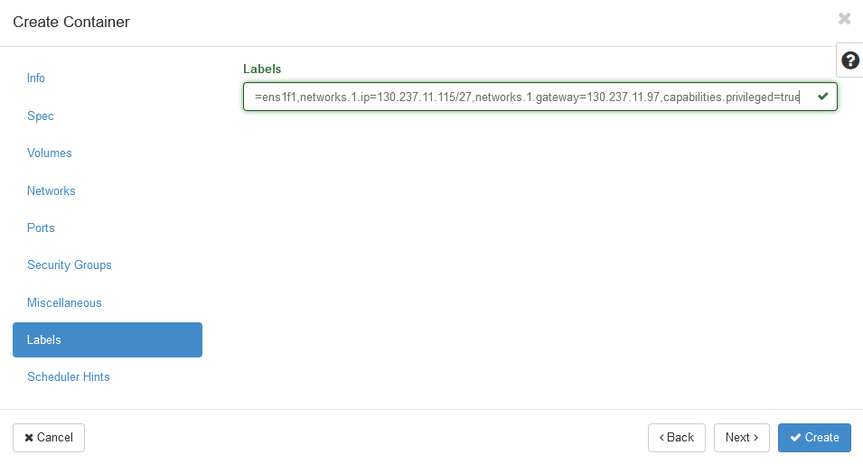
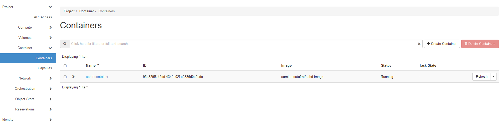
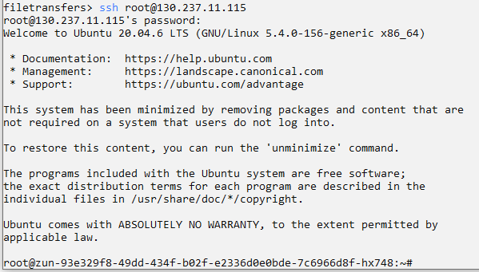

.. _container-vs-public:

====================================
Assigning a public IP to a container
====================================

This guide will walk you through the steps of assigning a public IP to a container.
This will allow worker node containers to have an IP address that can be used for access from the internet.

Step 1: Reserve a worker node
=============================

See the "reservation of a worker node" section.

Step 2: Create a container
==========================

Here, we connect a container application, running on a worker node, to a public IP. This involves including the container in the "serverpublic" network
when starting the container.

* From the ExPECA home page, click *Container* -> *Containers*

* Click *+ Create Container*
* See "Running a basic container" for the steps involved. We will here only focus on the data entered for network connection.
* Under "Networks" tab, bring "serverpublic" to the top
* Under "Miscellaneous" tab, enter environment variables needed for the container.
* Under "Labels" tab, enter a public IP address in the 130.237.11.[113-126]/27 range, as well as the "serverpublic" gateway.
 

* Click *Create*

* You should now be able to connect with SSH to your container from the internet.

