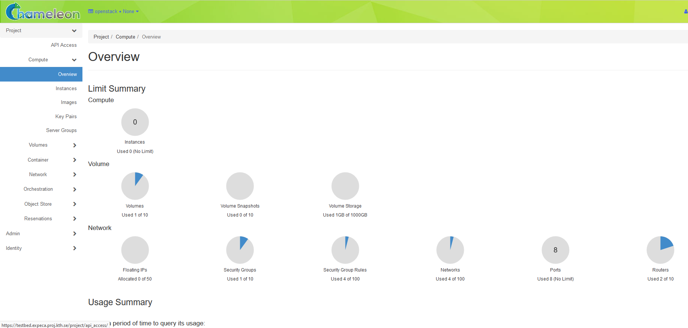
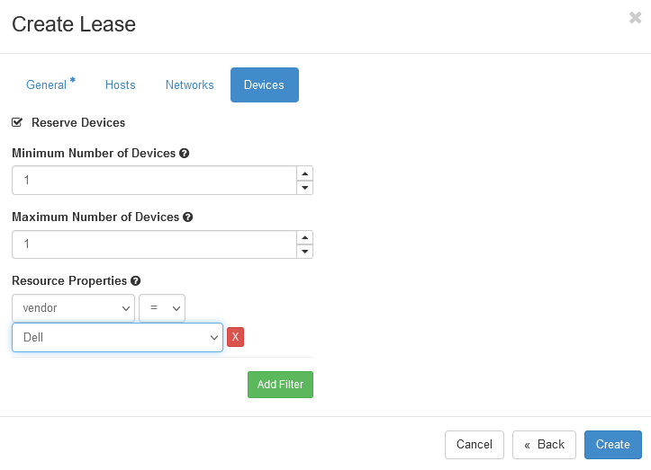

.. _InCommon: https://incommon.org/federation

.. _getting-started:

================
Getting started
================

This guide will walk you through the initial steps of getting an account
and working with your first instance.

.. contents:: :local:

.. _getting-started-user:

Step 1: Get a user account
==========================

To get a user account, send an email to <expecamail> with

* "ExPECA account request" in the subject header
* Name
* Phone number
* Email address
* Reason for the account request

After your request has been granted, we will then send you a reply with your login credentials.

Step 2: Log in to the ExPECA testbed
====================================

Just click the “Access the Testbed” button situated at the top of the `ExPECA main page
<https://expeca.proj.kth.se/>`_ and use your received credentials for login.

Step 3: Start using the ExPECA testbed
======================================

Congratulations, you are now ready to launch your first instance! 
Instances are "worker nodes", servers in the testbed, where you do not have full access 
to the actual server, but you can allocate and run Docker containerized applications on them.
When you reserve a "worker node," you have exclusive access to the underlying server.
Follow these steps to make a reservation for a worker node, launch an instance
and log in to it.

The ExPECA dashboard
--------------------

The dashboard shows a summary of your project's current resource usage and looks something like this:

   An overview of your current resource usage

Reserving a node
----------------

First, we need to reserve a worker node for our use. ExPECA provides access to allocate and run
Docker containerized applications on nodes.
When you create a reservation for one or more nodes, only you
and other users on your project will be able to use those nodes for the time
specified. We will create a single day reservation for a worker node.

#. In the sidebar, click *Reservations* -> *Leases*
#. Click on the *+ Create Lease* button in the toolbar
#. Type *my_first_lease* for the lease name
#. Check the *Devices* -> *Reserve Devices* box
#. Find the *Devices* -> *Resource Properties* section. In the dropdown below *vendor*, select *Dell*
#. Click the *Create* button

.. figure:: create_lease2.png
  :alt: The Create Lease dialog
  :figclass: screenshot

  The Create Lease dialog - be sure to select Dell in the dropdown below vendor

The reservation will start shortly, at which point you can launch an instance.

.. note::

   You have created an "on demand" reservation. When you do not specify a start
   date or time in the future, the reservation will start as soon as possible
   and will last one day.

.. important::

   Do not attempt to stack reservations to circumvent the 7-day lease
   limitation. Your leases may be deleted. Please refer to the `best practices
   <https://www.chameleoncloud.org/learn/frequently-asked-questions/#toc-what-are-the-best-practices-of-chameleon-usage->`_
   if you require a longer reservation.

Launching an instance
---------------------

Once the reservation starts, you can launch a bare metal instance on the node
that has been leased to you.

#. In the sidebar, click *Compute*, then click *Instances*

#. Click on the *Launch Instance* button in the toolbar and the *Launch
   Instance* wizard will load

#. Type *my_first_instance* for the instance name and select your
   *my_first_lease* reservation

   .. figure:: launch_details.png
      :alt: Launch details
      :figclass: screenshot

      Enter an instance name and select your reservation

#. Click *Source* in sidebar. Then, find *CC-CentOS8* in the image list and
   click the *Up* arrow to select it.

   .. figure:: launch_source.png
      :alt: Selecting an image
      :figclass: screenshot

      Select the CC-CentOS8 image

#. Click *Keypair* in sidebar. Click the *+ Create Key Pair* button and enter
   ``mychameleonkey`` for the key name. This will automatically start a download
   for a file named ``mychameleonkey.pem``. This is your private key pair that
   you will use to access your instance.

   .. figure:: launch_keypair.png
      :alt: Create a keypair to secure your instance
      :figclass: screenshot

      You can create or import a public/private keypair for accessing your
      instance.

#. Click the *Launch Instance* button.

Congratulations, you have launched an instance on a bare metal node!

.. _associating-an_ip:

Associating an IP address
-------------------------

Your instance may take approximately ten minutes to launch. The launch process
includes powering up, loading the operating system over the network, and booting
up for the first time on a rack located either at the University of Chicago or
the Texas Advanced Computing Center, depending on where you chose to launch your
instance. Before you can access your instance, you need to first assign a
floating IP address - an IP address that is accessible over the public Internet.

#. Go to the *Floating IP* dashboard by clicking on *Network* and *Floating IPs*
   in the sidebar.

    .. figure:: floating_ip_overview.png
       :alt: The Floating IP dashboard
       :figclass: screenshot

#. If you have a Floating IP not currently associated to an instance, click the
   *Associate* button for the IP. A dialog will load that allows you to assign a
   publicly accessible IP to your instance. Click the *Associate* button in the
   dialog to complete the process of associating the public IP to your instance.

   .. figure:: associate_ip.png
      :alt: The Manage Floating IP Associations dialog
      :figclass: screenshot

      Here you can assign a floating IP address

#. If you didn't already have a Floating IP available, you may allocate one to
   your project by clicking on the *Allocate IP to Project* button along the top
   row in the Floating IP dashboard. A new dialog will open for allocating the
   floating IP.

   .. figure:: associate_pool.png
      :alt: The Allocate Floating IP dialog
      :figclass: screenshot

      This dialog allows you to allocate an IP address from Chameleon's public
      IP pool

   Click the *Allocate IP* button. The Floating IP dashboard will reload and you
   should see your new Floating IP appear in the list. You can now go back to
   step 2.

Accessing Your Instance
-----------------------

Once your instance has launched with an associated floating IP address, it can
be accessed via SSH using the private key that you downloaded during the
`Launching an Instance`_ step.

.. note::

   The following instructions assume that you are using a macOS or Linux
   terminal equivalent. You may view our `YouTube video on how to login via SSH
   on Windows <https://youtu.be/MDK5D2ptJiQ>`_.

To log in to your instance, follow these steps:

#. Open a terminal window and navigate to where you downloaded the
   ``mychameleonkey.pem`` file. Change the permissions on the file to user
   read/write only:

   .. code-block:: bash

      chmod 600 mychameleonkey.pem

#. Add the key to your current SSH identity:

   .. code-block:: bash

      ssh-add mychameleonkey.pem

#. Log in to your Chameleon instance via SSH using the ``cc`` user account and
   your floating IP address. If your floating IP address was
   ``129.114.108.102``, you would use the command:

   .. code-block:: bash

      ssh cc@129.114.108.102

   .. note::

      Change the IP address in this command to match your instance's floating IP
      address!
