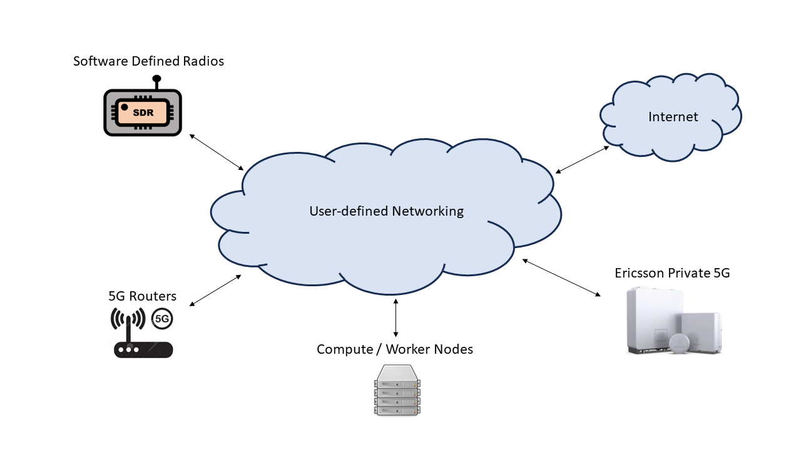

=================
Welcome to ExPECA
=================

ExPECA (Experimental Platform for Edge Computing Applications) is a project
targeting the development and provisioning of an edge computing infrastructure
for research into novel applications and network architectures.

As part of this project, a testbed has been constructed that allows for flexible
experimentation of Wireless Edge Computing applications in an environment free 
from radio interference. It consists of a server/networking center and a collection
of radio equipment.

EP5G (Ericsson Private 5G) equipment has been integrated with the testbed, both core and radio parts.

The radio equipment is mounted in the old reactor hall, R1, at The Royal Institute of Technology in Stockholm. 
It is located 25 meters below ground, well isolated from outside radio interference, and with a large area to spread
the equipment, in all dimensions. This means that we do not need to be concerned about radio spectrum usage, etc.

The ExPECA testbed orchestration is an adapted version of Chameleon, which is an NSF-funded 
testbed system for Computer Science experimentation.
It uses Openstack, and is designed to be deeply reconfigurable, with a wide variety of capabilities
for researching systems, networking, distributed and cluster computing and
security. The ExPECA testbed includes:

* 4 "radio dots," which are the radio base stations for the EP5G system
* A set of servers that run EP5G CN (Core Network) and RAN (Radio Access Network) applications
* 11 SDR (Software Defined Radio) units, which can be programmed for various capabilities (5G base station, WiFi, etc)
* 9 Advantech 5G routers, which can act as UE (User Equipment) radio access
* 10 "worker nodes" (bare metal servers), where Docker containerized applications can run, as determined by Openstack orchestration
* 1 GNSS/PTP "grandmaster clock," which distributes GNSS/PTP synchronization from GPS satellites down to the underground testbed
* Additional servers and networking equipment necessary for the Openstack orchestration of resources (controller, storage, routers, switches, etc)

Through the Chameleon-based user interface, radio resources and worker nodes can be reserved for experimentation, and networking be defined for communication.
Docker containerized applications can be allocated to worker nodes.
