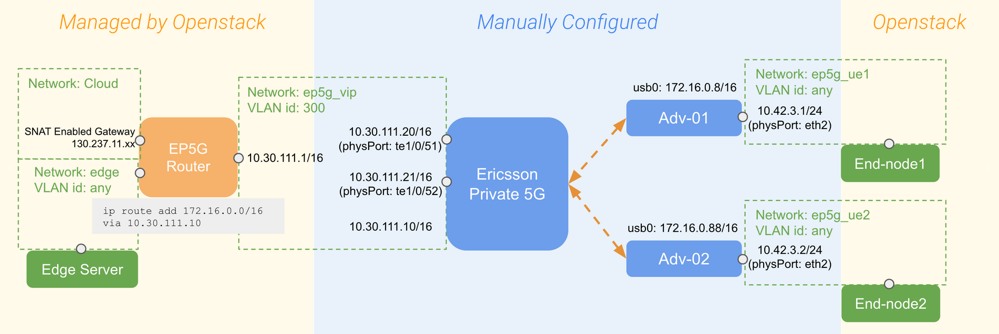
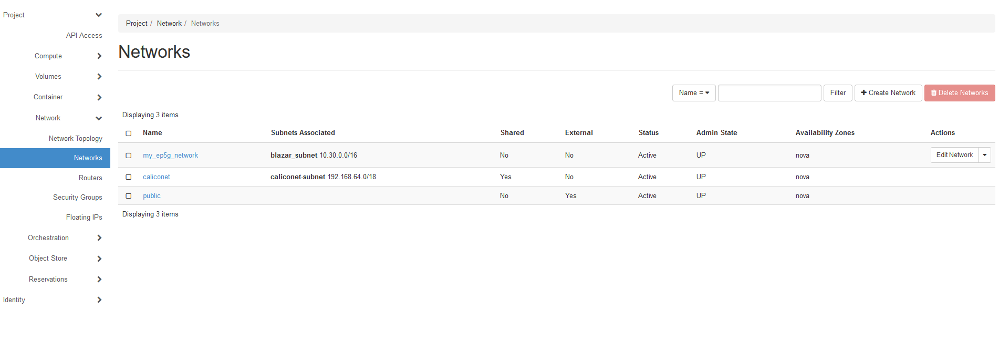
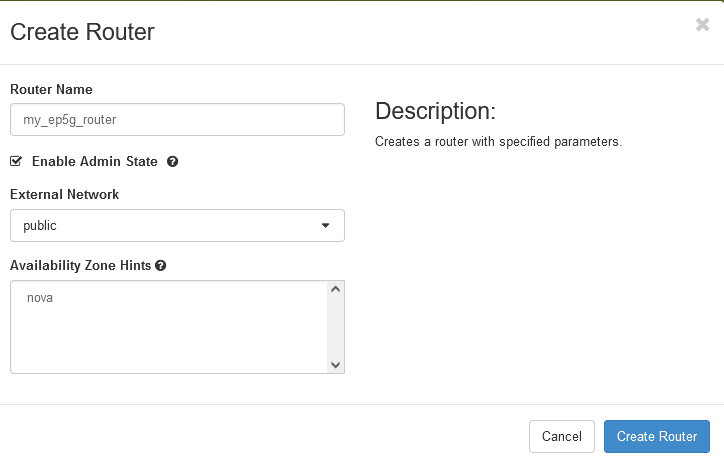
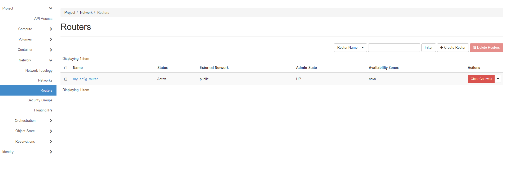
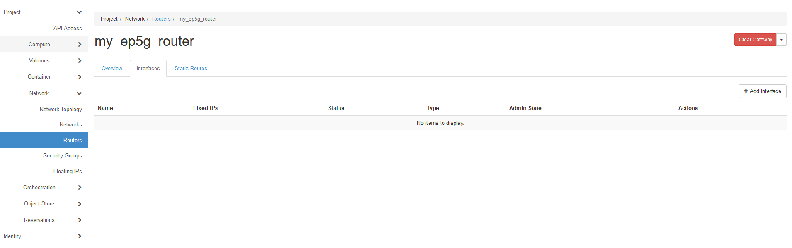
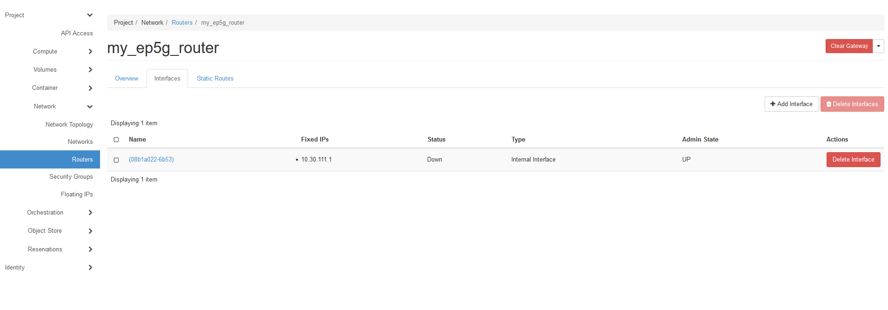
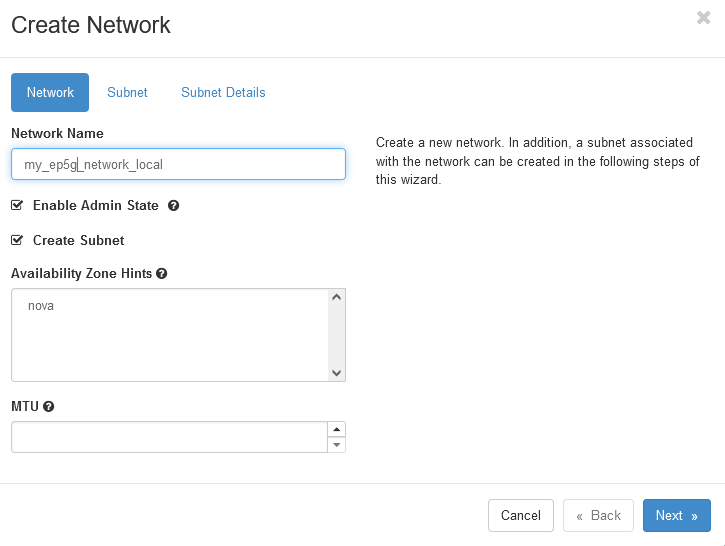
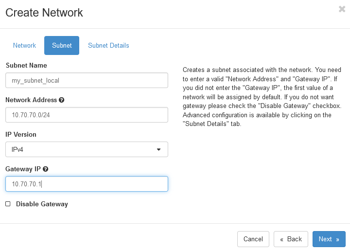
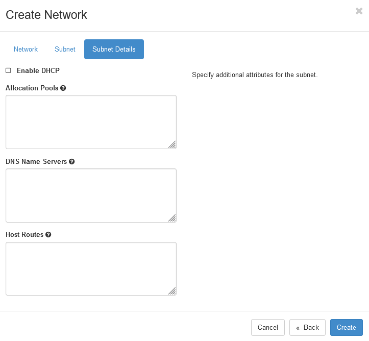
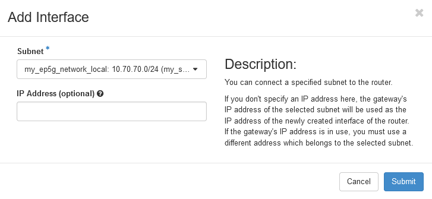

.. _network-ep5g:

===========================
Network definition for EP5G
===========================

This guide will walk you through the steps of defining networking for EP5G (Ericsson Private 5G).
The operation of the EP5G within ExPECA requires that networks and routers are defined from the view
of Openstack.

Step 1: Reserve EP5G
====================

See the "reservation of EP5G" section.

When reserving EP5G, a network is automatically created within Openstack with a name that is given in the reservation process.

.. figure:: network_check2.png
  :alt: Routers main page
  :figclass: screenshot
.. figure:: network_check3.png
  :alt: Routers main page
  :figclass: screenshot

Step 2: Create a router
=======================

* From the ExPECA home page, click *Network* -> *Routers*

.. figure:: router1.png
  :alt: Routers main page
  :figclass: screenshot

* Click *+ Create Router*
* Give the router a name, and select "public" under *External Network*
* Click *Create*

.. figure:: router4.png
  :alt: Router overview
  :figclass: screenshot

* Click on your router. Under *Interfaces* tab, click *+ Add Interface*

* Select the automatically created subnet under *Subnet*
* Set IP address to the "default gateway," which is 10.30.111.1 (See the overall network diagram at the top of this page)
* Click *Submit*

.. figure:: router6.png
  :alt: Router add interface
  :figclass: screenshot

* Under *Static Routes* tab, type destination CIDR 172.16.0.0/16 and next hop 10.30.11.10, so traffic in direction towards end users
  (wireless Advantech routers, in this case) is routed

.. figure:: router8.png
  :alt: Router add static route
  :figclass: screenshot

* At this time, the networking to communicate via EP5G towards the internet is defined, and if you have any user equipment connected
  to EP5G, they should be able to communicate with the internet.
* If you want to communicate with local edge servers (worker nodes), you have to defined yet another network and include it in your router
  definitions. Again, see the diagram at the top of this page.
* Under *Networks* -> *+ Create Network*, create a new network

* Define a subnet that can reach the container you want to communicate with in a worker node. The actual data will depend on the container address.
  In this case, the subnet is "10.70.70.0/24".

* Under *Subnet Details*, uncheck the DHCP box, and the click *Create*

* Now go back to *Routers* on the left panel. Click on your newly defined router, and under *Interfaces* tab, click "Add Interface".
  Add the the new local network as subnet. You can leave the IP address blank if you want. Then, the IP address you have earlier defined as
  gateway of the subnet will be used for the interface. Click *Submit*.

* You should now also be able to reach your edge container located on a worker node from your user equipment

