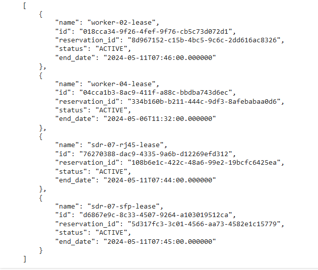

.. _python-notebook:

=========================
Running a Python Notebook
=========================

This guide will walk you through the steps of running a Python Notebook to configure the ExPECA testbed.
For this example, we have chosen a notebook that reserves and configures a Software Defined Radio plus a Worker Node (edge server).

Step 1: Log in to ExPECA
========================

Log in to the ExPECA testbed and navigate to your project.

Step 2: Open the Python notebook in a separate browser
======================================================

Open the Python notebook by navigating to its location in Github.

Step 3: Open the notebook in Colab and get authentication file
==============================================================

* Click the "Open in Colab" button at the top of the notebook
  

* This will open the notebook in Colab. Note that there is a file manager icon on the left side. Click on it to expand the left pane.

.. figure:: ipynb02.png
  :alt: Colab start view
  :figclass: screenshot

* Click the link to download the openrc.sh file. A new tab will open.

.. figure:: ipynb03.png
  :alt: Authentication file link
  :figclass: screenshot

* Click the given link. This will download the openrc.sh file to your local computer. Upload it to your Colab file system on the left pane.

* Change the openrc.sh file name so that it exactly matches what is expected in the notebook

Step 4: Run/play the cells in the notebook
===================================================

* Run the first cell (authentication) in the notebook by clicking the "play" symbol on the top left side
* When prompted for password, use the password that you previously used to log in to the ExPECA testbed
* A green check mark by the "play" symbol will indicate successful execution

.. figure:: ipynb05.png
  :alt: Run authentication cell
  :figclass: screenshot

* Run the cell for installation of required packages and dependencies

* Run the cell for importing Python packages

* Run the cell for reserving resources (SDRs, worker nodes, etc) in the testbed. This creates leases and networks in the testbed

.. figure:: ipynb08.png
  :alt: Run resource resrvation cell
  :figclass: screenshot
.. figure:: ipynb09.png
  :alt: Run resource resrvation cell, continued
  :figclass: screenshot

* Run the cell that changes the SDR design to NI or MANGO

.. figure:: ipynb11.png
  :alt: Run SDR design change cell
  :figclass: screenshot

* If needed, run the cell for rebooting the SDR. In this case it is optional, because the SDR was rebooted in the previous cell

* You can now go back to the ExPECA testbed management and check that the leases were created

.. figure:: ipynb13.png
  :alt: ExPECA testbed leases
  :figclass: screenshot

* You can also check that the networks associated with the SDR were created. SFP = NI and RJ45 = MANGO.

.. figure:: ipynb14.png
  :alt: ExPECA testbed leases
  :figclass: screenshot

