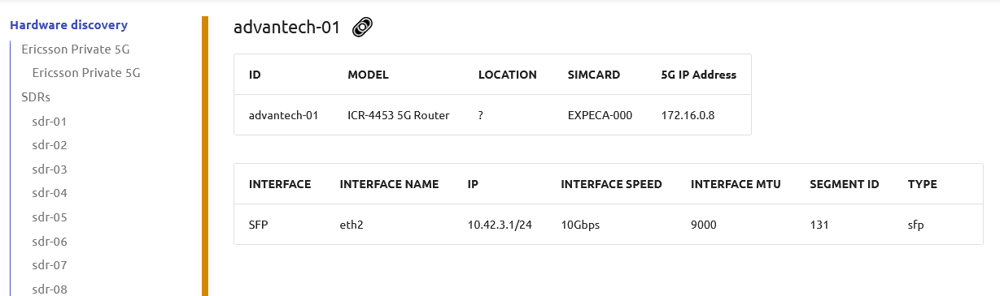
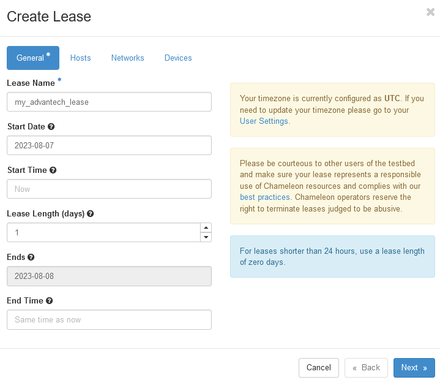
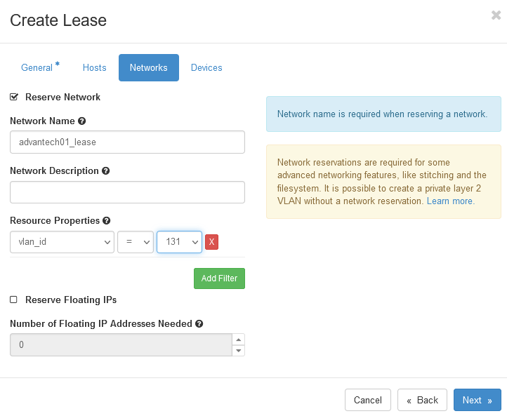

.. _reservation-advantech:

==================================
Reservation of an Advantech router
==================================

This guide will walk you through the steps of looking up Advantech router resources and
reserving a router.

Step 1: Check Hardware discovery
================================

* From the ExPECA home page, click *Hardware discovery*
* Look up an Advantech router that satisfies your requirements. Note the "segment ID" for the router. You will use it later to make your reservation.

Step 2: Reserving an Advantech router
=====================================

We need to reserve an Advantech router for our use.
When you create a reservation for one or more Advantech routers, only you
and other users on your project will be able to use those routers for the time
specified. We will create a single day reservation for an Advantech router.

* In the sidebar, click *Reservations* -> *Leases*

.. figure:: lease01.png
  :alt: Main lease view
  :figclass: screenshot

* Click *Network Calendar*. This shows the current Advantech router reservations (identified by "segment ID") in the system. Make sure the Advantech router
  you want is not reserved for the time you need it.

.. figure:: network_calendar.png
  :alt: Network calendar
  :figclass: screenshot

* Go back to the main lease page
* Click on the *+ Create Lease* button in the toolbar
* Type *my_advantech_lease* for the lease name (or any name you want to call it)
* Make sure you always select a Start Date

* Check the *Networks* -> *Reserve Network* box
* Type *advantech01_network* for the network name (or any name you want to call it, depending on which SDR you want)
* Find the *Networks* -> *Resource Properties* section. In the dropdown below *vlan_id*, select the "segment ID" you have for the Advantech router you want.
* Click the *Next* button, and then *Create*

The reservation will start shortly, at which point you can continue.

.. note::

   When you set taday as start date and *now* as start time, the reservation will start as soon as possible
   and will last one day.

.. important::

   Do not attempt to stack reservations to circumvent the 7-day lease
   limitation. Your leases may be deleted. Please refer to the `best practices
   <https://www.chameleoncloud.org/learn/frequently-asked-questions/#toc-what-are-the-best-practices-of-chameleon-usage->`_
   if you require a longer reservation.

