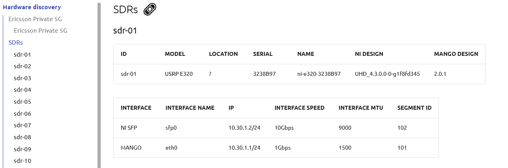
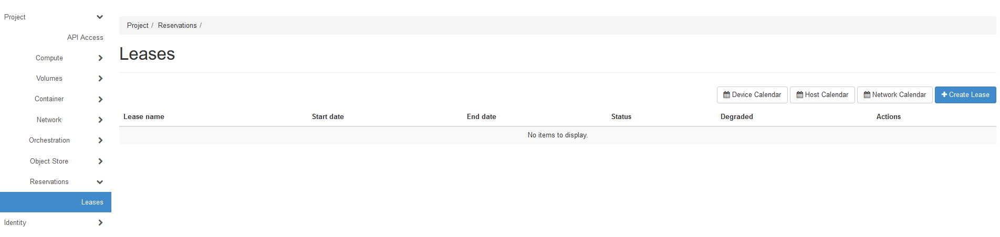
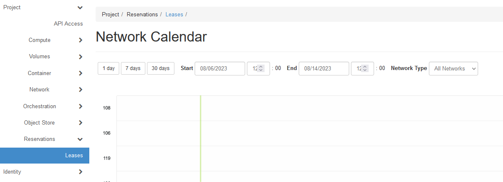
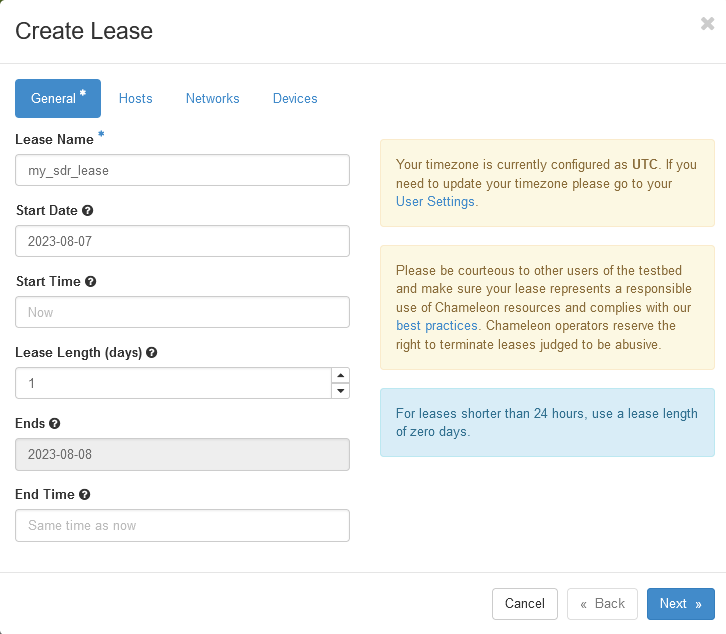
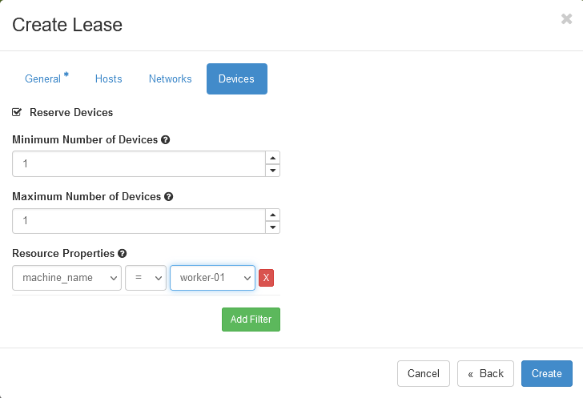

.. _reservation-sdr:

=====================
Reservation of an SDR
=====================

This guide will walk you through the steps of looking up SDR (Software Defined Radio) resources and
reserving an SDR.

Step 1: Check Hardware discovery
================================

* From the ExPECA home page, click *Hardware discovery*
* Look up an SDR that satisfies your requirements. Note the "segment ID" for the SDR. You will use it later to make your reservation.

Step 2: Reserving an SDR
========================

We need to reserve an SDR for our use.
When you create a reservation for one or more SDR units, only you
and other users on your project will be able to use those nodes for the time
specified. We will create a single day reservation for an SDR.

* In the sidebar, click *Reservations* -> *Leases*

* Click *Network Calendar*. This shows the current SDR reservations (identified by "segment ID") in the system. Make sure the SDR
  you want is not reserved for the time you need it.

* Go back to the main lease page
* Click on the *+ Create Lease* button in the toolbar
* Type *my_sdr_lease* for the lease name (or any name you want to call it)
* Make sure you always select a Start Date

* Check the *Networks* -> *Reserve Network* box
* Type *sdr1_network* for the network name (or any name you want to call it, depending on which SDR you want)
* Find the *Networks* -> *Resource Properties* section. In the dropdown below *vlan_id*, select the "segment ID" you have for the SDR you want.
* Click the *Next* button, and then *Create*

The reservation will start shortly, at which point you can continue.

.. note::

   When you set taday as start date and *now* as start time, the reservation will start as soon as possible
   and will last one day.

.. important::

   Do not attempt to stack reservations to circumvent the 7-day lease
   limitation. Your leases may be deleted. Please refer to the `best practices
   <https://www.chameleoncloud.org/learn/frequently-asked-questions/#toc-what-are-the-best-practices-of-chameleon-usage->`_
   if you require a longer reservation.

