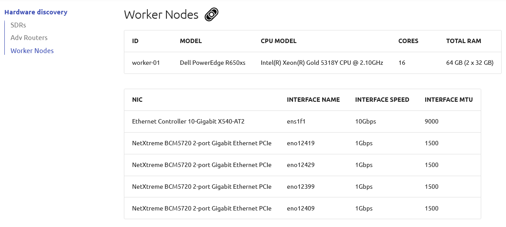
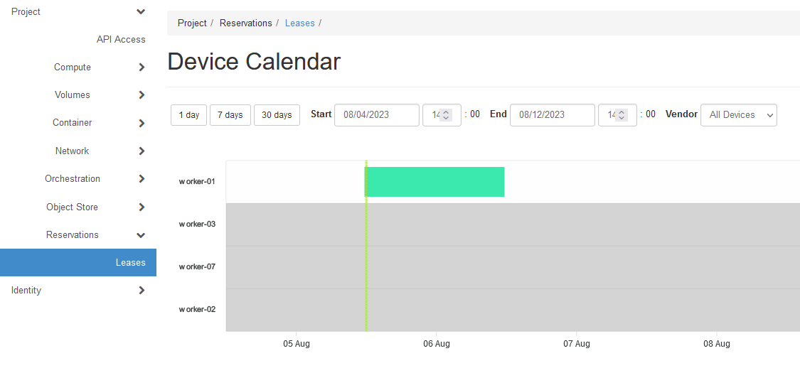
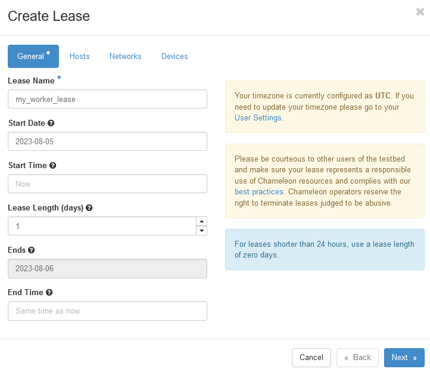
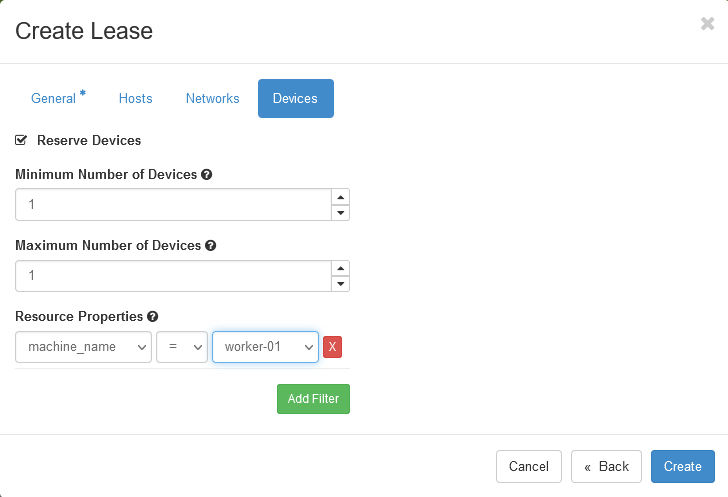

.. _reservation-worker:

============================
Reservation of a worker node
============================

This guide will walk you through the steps of looking up worker node resources and
reserving a worker node.

Step 1: Check Hardware discovery
================================

* From the ExPECA home page, click *Hardware discovery*
* Look up a worker node that satisfies your requirements

Step 2: Reserving a worker node
===============================

We need to reserve a worker node for our use. ExPECA provides access to allocate and run
Docker containerized applications on nodes.
When you create a reservation for one or more nodes, only you
and other users on your project will be able to use those nodes for the time
specified. We will create a single day reservation for a worker node.

* In the sidebar, click *Reservations* -> *Leases*

.. figure:: lease01.png
  :alt: Main lease view
  :figclass: screenshot

* Click *Device Calendar*. This shows the current worker node reservations in the system. Make sure the worker node
  you want is not reserved for the time you need it.

* Go back to the main lease page
* Click on the *+ Create Lease* button in the toolbar
* Type *my_worker_lease* for the lease name (or any name you want to call it)
* Make sure you always select a Start Date

* Check the *Devices* -> *Reserve Devices* box
* Find the *Devices* -> *Resource Properties* section. In the dropdown below *machine_name*, select the worker node you want
* Click the *Create* button

The reservation will start shortly, at which point you can continue.

.. note::

   When you set taday as start date and *now* as start time, the reservation will start as soon as possible
   and will last one day.

.. important::

   Do not attempt to stack reservations to circumvent the 7-day lease
   limitation. Your leases may be deleted. Please refer to the `best practices
   <https://www.chameleoncloud.org/learn/frequently-asked-questions/#toc-what-are-the-best-practices-of-chameleon-usage->`_
   if you require a longer reservation.

