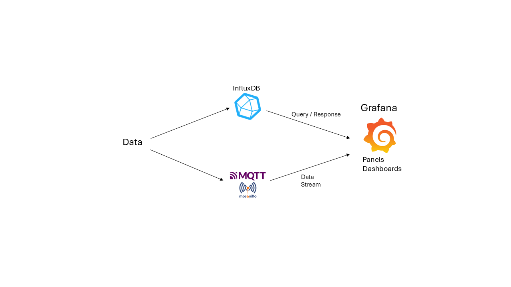
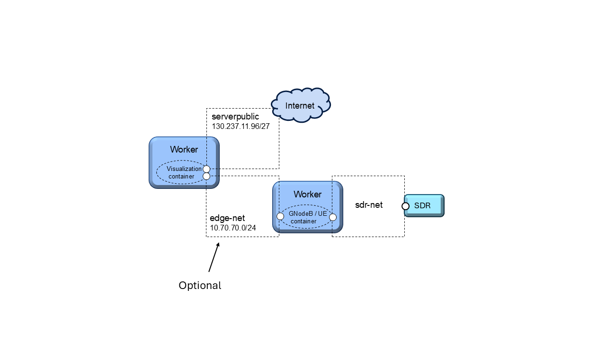
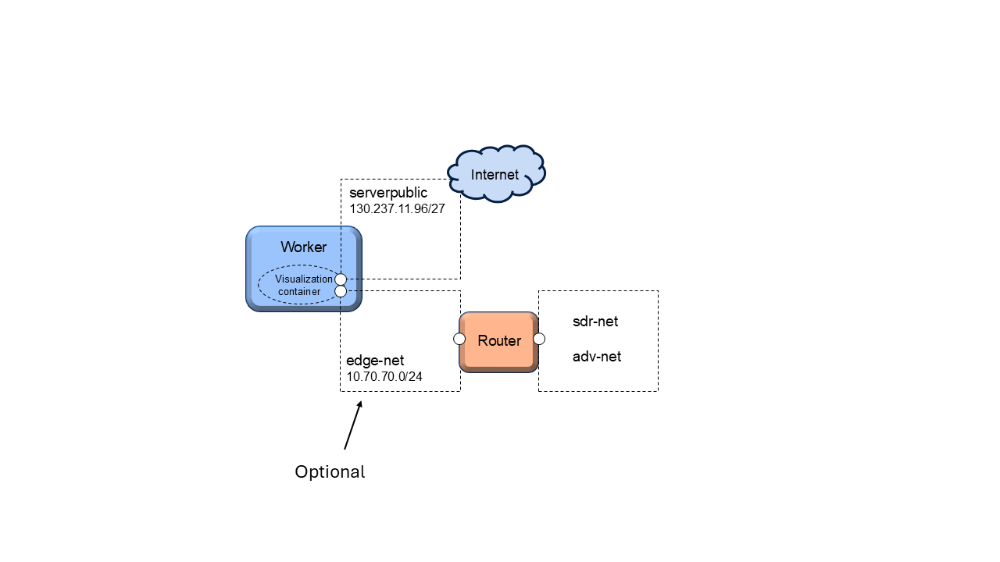

.. _visualization:

==================
Data Visualization
==================

This guide provides an overview of our containerized visualization system and step-by-step instructions for starting and configuring it using accompanying Python scripts.

Repository and Resources
========================

All Python notebooks and scripts for setting up and configuring the visualization system are available in our GitHub repository:

**GitHub Repository:**  
`KTH-EXPECA/examples <https://github.com/KTH-EXPECA/examples/tree/main/observability>`_

For a more detailed description of the system, refer to the `README.md` file in the repository.

Overview
========

The visualization system is designed to handle time-series data efficiently. Users send data to an **InfluxDB database** or an **MQTT Broker**. **Grafana** then queries the database or receives a data stream from the broker, enabling real-time visualization in a customizable dashboard.

System Architecture
-------------------

The core components of the system—InfluxDB, MQTT Broker, and Grafana—are packaged within a Docker container that runs on a **testbed worker node (server)**. The container is accessible via a public IP and can optionally connect to an internal **"edge-net"** network.

   **High-Level Visualization System Architecture**

The system supports multiple networking configurations:

- Direct communication over **Public IP**
- Internal connectivity via **edge-net**
- Routing through a **user-defined router** for additional network flexibility

.. figure:: visualization02.png
   :alt: Visualization System Overview
   :align: center
   :figclass: screenshot

   **Full Visualization System Overview**

Testbed Configuration
---------------------

A **Python notebook** defines the testbed configuration. This notebook launches the visualization container within a testbed worker node, connecting it to either:

- **"serverpublic"** (internet)
- **"edge-net"** (internal network)

Containers can interact with the visualization system via public IPs or direct **edge-net** connections.

   **Testbed Configuration with Edge Interface**

Alternatively, a user-defined **router** can facilitate communication between different networks.

   **Testbed Configuration with Router Interface**

Typical Setup Procedure
=======================

Setting up the visualization system is quick, secure, and repeatable. Follow these steps:

#. **Run the appropriate Jupyter notebook:**
   
   - `visual_public.ipynb` (for public access)
   - `visual_public_edge.ipynb` (for edge-net access)

#. **Configure system parameters:**
   
   - Ensure correct values are set in `config_data.json`

#. **Have Grafana dashboard backup ready:**
   
   - If needed, have Grafana dashboard backup ready in `datasources.json/dashboards.json` files

#. **Run the configuration script:**
   
   - Execute `visual_config.py` to initiate a sequence of setup scripts

For more details about the scripts, including how they work, how they customize credentials, etc, please refer to the
`README.md` file in the Github repository.

Once the setup is complete, your visualization system will be up and running within minutes. You will have:

* Secure credentials  
* A fully configured system  
* Grafana dashboards ready to visualize your latest experiments  

By following this guide, you can deploy a robust and scalable visualization system for real-time data monitoring and analysis.
